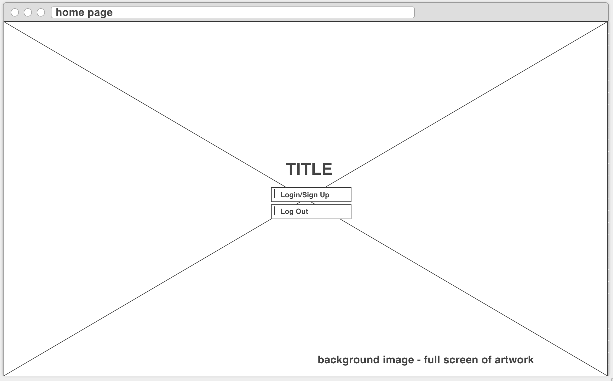
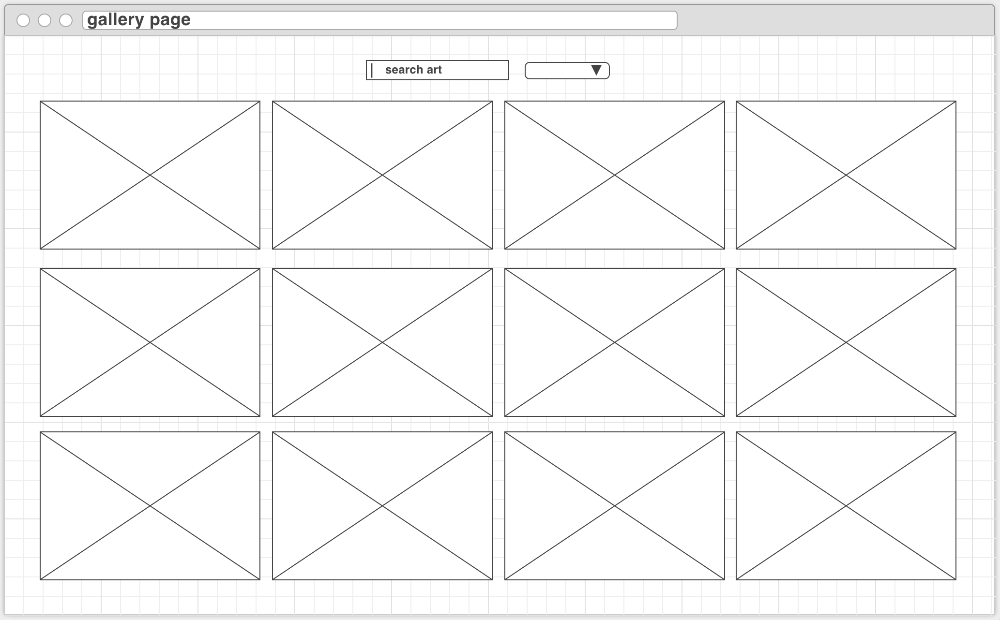

# art-project
An application that allows users to log in and save their favorite works of art from museums around the world!

- Imagine a virtual museum or art gallery of the world's best art, where you can log in and save your favorite works, available to view any place and any time you have an internet collection. The application would use art API's like Artsy's API, Europeana API, and the Rijksmuseum API, which houses a database of their entire collection - one of the finest of Dutch art in the world. The applicaton would store each user's favorites and present them in a visually pleasing way, clean and neat with a focus on the art itself and on smooth functionality.
- I want to aggregate API data from various museums. The home page will have users log in to their account, and from there they'll be able to navigate to a museum collection. In each collection page, when the user saves an artwork to their favorites they'll be able to navigate to a "my gallery" type page where they can see all their favorites from the museums that they've chosen, all aggregated in one place.

IDEAS
- Search by artist
- Search by nationality
- Search by century

- As a user I should be able to log into my own, authenticated account.
- As a user I should be able to browse a listing of art works by artist, nation, museum, or period. 
- As a user I should be able to click on an artwork and see a detailed description of the piece in a modal that pops up. 
- As a user I should be able to choose favorite works of art and save them for later.
- As a user I should be able to view my favorite works in a clean and simple viewframe.

WIREFRAMES

